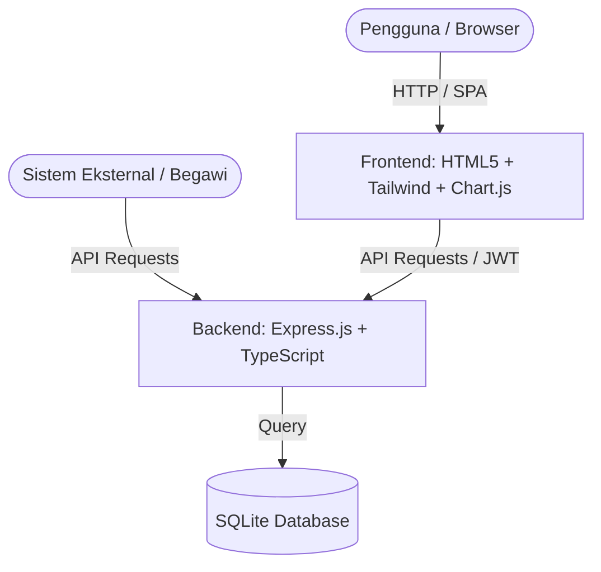

# Blueprint Aplikasi: Evan-ID (Elektronik Verification And Analytics Nominatif - Integrated Dashboard)

Evan-ID adalah sistem API & Dashboard Kepegawaian terpadu untuk pengelolaan Buku Nominatif Jabatan di Kabupaten Tanggamus. Sistem ini dirancang untuk menyajikan analisis data kepegawaian secara visual, memfasilitasi pencarian pejabat, mengevaluasi status jabatan (Definitif, Pelaksana Tugas, Lowong), serta menyediakan integrasi API yang aman dengan sistem eksternal (seperti Super Apps, Web BKPSDM, atau Mobile App).

---

## 🏛️ Arsitektur Aplikasi

Aplikasi ini menggunakan arsitektur **monolitik ringan** dengan pemisahan tanggung jawab yang jelas antara Backend (API) dan Frontend (Dashboard Statis):



### 1. Backend (API Server)
*   **Teknologi**: Node.js, Express, TypeScript, `ts-node-dev`.
*   **Database**: SQLite (`sqlite3`) untuk penyimpanan lokal yang efisien dan tanpa overhead server database terpisah.
*   **Authentication**: JSON Web Token (JWT) dengan pengamanan berbasis peran (*role-based access control*).
*   **Keamanan**: Enkripsi password menggunakan `bcryptjs`, proteksi CORS, dan pembatasan eksposur PII (Personally Identifiable Information) untuk pengguna anonim.

### 2. Frontend (Dashboard)
*   **Teknologi**: Single Page Application (SPA) menggunakan HTML5, Tailwind CSS (via CDN), Vanilla JavaScript.
*   **Visualisasi**: Chart.js dengan plugin datalabels untuk diagram statistik interaktif.
*   **Keamanan Frontend**: Manajemen sesi berbasis JWT yang disimpan di LocalStorage/SessionStorage.

---

## 🗄️ Skema Database (SQLite)

Database utama disimpan dalam berkas `database.sqlite` di root direktori dengan skema sebagai berikut:

### 1. Tabel `pejabat`
Menyimpan data lengkap pejabat struktural dan fungsional di lingkungan pemerintahan.
*   `id` (INTEGER, PRIMARY KEY AUTOINCREMENT)
*   `no` (INTEGER) - Nomor urut
*   `kd` (TEXT) - Kode unit kerja singkat (misal: `SETDA`, `BKPSDM`)
*   `opd` (TEXT, NOT NULL) - Nama lengkap Organisasi Perangkat Daerah
*   `nama_jabatan_structural` (TEXT)
*   `nama_jabatan_fungsional` (TEXT)
*   `nama_jabatan` (TEXT) - Nama jabatan aktif
*   `nama_pejabat` (TEXT)
*   `ket_status` (TEXT) - Status keaktifan/jabatan (`Definitif`, `Pelaksana Tugas`, `Lowong`)
*   `nip` (TEXT) - Nomor Induk Pegawai (sensitif)
*   `pangkat_gol_tmt` (TEXT) - Pangkat, golongan, dan Terhitung Mulai Tanggal
*   `pendidikan` (TEXT) - Riwayat pendidikan tertinggi
*   `tmt_jabatan` (TEXT) - TMT Jabatan aktif
*   `mkj_terakhir` (TEXT) - Masa kerja jabatan terakhir
*   `kode_eselon` (TEXT) - Eselon (misal: `2A`, `2B`, `3A`, `3B`, `4A`, `4B`, `JF`, `-`)
*   `tmt_eselon` (TEXT) - TMT Eselon
*   `mkj_eselon` (TEXT) - Masa kerja eselon
*   `ket` (TEXT) - Keterangan tambahan (misal: `PIM II`, `PIM III`)
*   `agama` (TEXT)
*   `jk_gender` (TEXT) - Jenis kelamin (`Laki-Laki`, `Perempuan`)
*   `nilai_kinerja` (TEXT) - Nilai evaluasi kinerja (misal: `Baik`, `Sangat Baik`)
*   `kompetensi_teknis` (INTEGER)
*   `kompetensi_manajerial` (INTEGER)
*   `kompetensi_social_kultural` (INTEGER)
*   `kategori` (TEXT)
*   `tahun_kinerja` (INTEGER)
*   `rencana_karir` (TEXT)
*   `rencana_kompetensi` (TEXT)
*   `tanggal_lahir` (TEXT)
*   `usia` (TEXT) - Usia hasil kalkulasi dinamis
*   `tmt_pensiun` (TEXT) - TMT Pensiun

### 2. Tabel `users`
Menyimpan akun pengguna yang memiliki hak akses ke sistem dashboard.
*   `id` (INTEGER, PRIMARY KEY AUTOINCREMENT)
*   `username` (TEXT, UNIQUE, NOT NULL)
*   `password` (TEXT, NOT NULL) - Hash bcrypt
*   `name` (TEXT, NOT NULL) - Nama lengkap pengguna
*   `role` (TEXT, CHECK IN ('admin', 'editor', 'viewer'), NOT NULL)

### 3. Tabel `audit_logs`
Mencatat seluruh aksi administratif yang dilakukan oleh admin atau editor untuk kepatuhan keamanan.
*   `id` (INTEGER, PRIMARY KEY AUTOINCREMENT)
*   `username` (TEXT)
*   `action` (TEXT)
*   `details` (TEXT)
*   `timestamp` (DATETIME, DEFAULT CURRENT_TIMESTAMP)

---

## ⚙️ Fitur Utama Aplikasi

1.  **Dashboard Analytics & Statistik**:
    *   Visualisasi distribusi status jabatan (Definitif vs Plt vs Lowong).
    *   Statistik eselonering dan kualifikasi pendidikan pejabat.
    *   Analisis gender di lingkungan kepegawaian.
2.  **Pencarian dan Penyaringan (Search & Filter)**:
    *   Pencarian teks lengkap berdasarkan nama pejabat, NIP, atau nama jabatan.
    *   Filter multi-dimensi berdasarkan OPD, eselon, status jabatan, dan jenis kelamin.
3.  **Detail Profil Pejabat (Kepatuhan PII)**:
    *   Menampilkan data publik untuk tamu/anonim (Nama, Jabatan, OPD, Golongan).
    *   Menampilkan data sensitif (NIP, Pendidikan, Rencana Karir, Hasil Kompetensi, Kinerja) hanya setelah login JWT yang valid.
4.  **Ekspor Dokumen (Export to Excel)**:
    *   Mengunduh data nominatif lengkap dalam format `.xlsx` (hanya untuk pengguna yang terautentikasi).
5.  **Manajemen Log Audit**:
    *   Mencatat perubahan, aktivitas ekspor, login, dan aksi krusial ke tabel `audit_logs`.
6.  **Opsi Integrasi Eksternal**:
    *   Mendukung penarikan data pegawai langsung dari API eksternal (layanan *Begawi* / integrasi dinamis) melalui pengaturan environment variable.

---

## 🔌 API Endpoints Reference

### Public / Optional Auth Endpoints
*   `GET /api/pejabat` - Mengambil daftar pejabat (terfilter & terpaginasi). Menyembunyikan bidang PII jika tidak terautentikasi.
*   `GET /api/pejabat/:nip` - Mengambil detail pejabat berdasarkan NIP.
*   `GET /api/opd` - Mengambil semua OPD dan jumlah pejabatnya.
*   `POST /api/auth/login` - Autentikasi pengguna menggunakan username & password.

### Authenticated Endpoints (Membutuhkan Header `Authorization: Bearer <token>`)
*   `POST /api/pejabat` - Menambahkan data pejabat baru (Role: `admin`, `editor`).
*   `PUT /api/pejabat/:id` - Memperbarui data pejabat (Role: `admin`, `editor`).
*   `DELETE /api/pejabat/:id` - Menghapus data pejabat (Role: `admin`).
*   `GET /api/export/excel` - Ekspor data pejabat ke Excel.
*   `GET /api/audit-logs` - Mengambil riwayat log audit (Role: `admin`).

---

## 📂 Struktur Direktori Proyek

```text
├── .agents/                    # Kustomisasi agen AI lokal
├── dist/                       # Output kompilasi TypeScript (dihasilkan setelah build)
├── public/                     # Static files yang disajikan oleh Express
│   ├── Lambang_Kabupaten_Tanggamus.png
│   ├── index.html              # Frontend Dashboard
│   └── api/                    # Integrasi endpoint frontend
├── src/                        # Source code backend (TypeScript)
│   ├── auth.ts                 # Middleware JWT & enkripsi
│   ├── database.ts             # Inisialisasi database & operasi helper SQL
│   ├── parser.ts               # Parser untuk import data dari excel (.xlsx)
│   └── server.ts               # Entry point Express server & routing
├── BUKU NOMINATIF JABATAN TAHUN 2026 Terbaru.xlsx # Sumber data seeding
├── Dockerfile                  # Konfigurasi container docker
├── docker-compose.yml          # Konfigurasi orkestrasi container
├── package.json                # Project dependencies & scripts
├── tsconfig.json               # Konfigurasi compiler TypeScript
└── blueprint.md                # Dokumentasi arsitektur sistem (Berkas ini)
```

---

## 🚀 Panduan Menjalankan Aplikasi

### Persiapan Lingkungan (.env)
Buat berkas `.env` di root direktori dengan isi berikut:
```env
PORT=3005
JWT_SECRET=gunakan_kunci_rahasia_yang_sangat_kuat_disini
INTEGRATION_BEGAWI_ENABLED=false
INTEGRATION_BEGAWI_URL=http://localhost:3001
INTEGRATION_BEGAWI_API_KEY=your_begawi_api_key
```

### Menjalankan dalam Mode Pengembangan (Local)
1.  Instal dependensi:
    ```bash
    npm install
    ```
2.  Jalankan server pengembangan:
    ```bash
    npm run dev
    ```
3.  Buka browser di `http://localhost:3005` untuk mengakses Dashboard.
    *   *Catatan*: Pada inisialisasi pertama, sistem akan membuat file `database.sqlite`, mem-parsing data dari spreadsheet `.xlsx` bawaan, dan membuat akun default dengan kata sandi acak yang dicatat dalam file `INITIAL_CREDENTIALS.txt`.

### Menjalankan dengan Docker
1.  Build dan jalankan container:
    ```bash
    docker-compose up -d --build
    ```
2.  Aplikasi akan berjalan dan dapat diakses di port `3005`.
